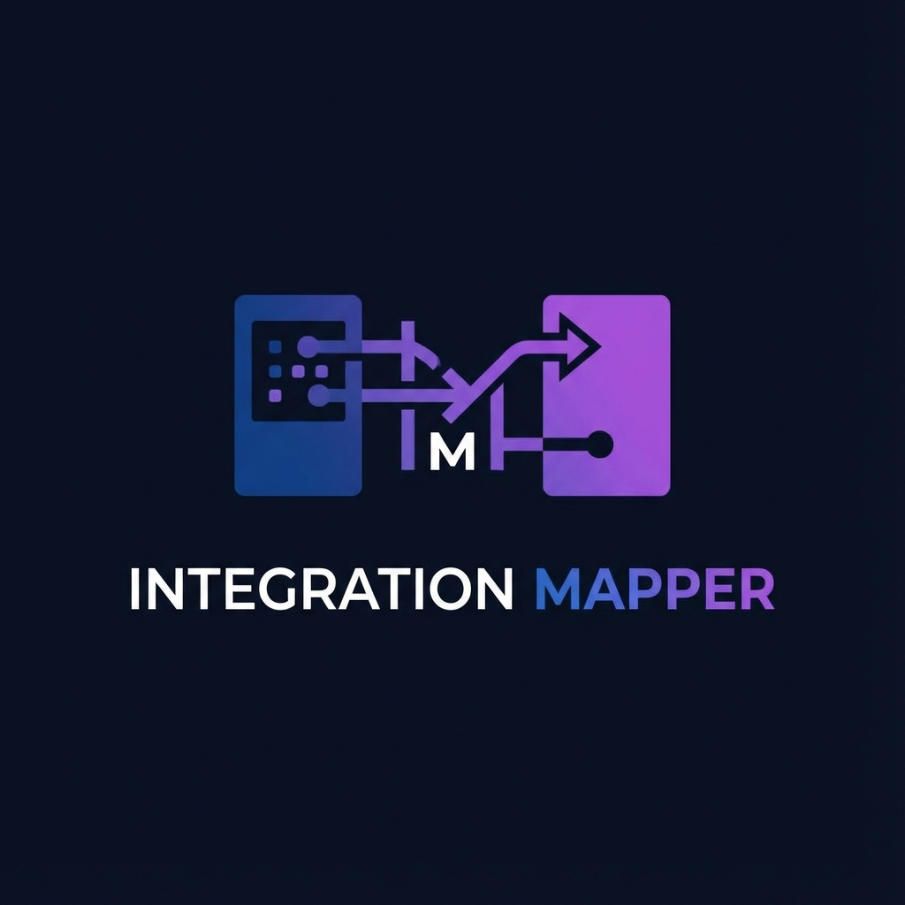

# Integration Mapper

A visual tool for mapping data structures between different systems.



## Overview

Integration Mapper is a full-stack solution designed to simplify the process of defining data transformations between source and target systems. It provides a drag-and-drop interface for mapping fields, supports AI-assisted mapping suggestions, and allows exporting specifications to Excel or generating C# mapping code.

## Architecture

The solution follows a **Clean Architecture** approach:

*   **IntegrationMapper.Web**: Frontend application built with **React**, **Vite**, and **TypeScript**. It uses **React Flow** for the visual mapping canvas.
*   **IntegrationMapper.Api**: Backend REST API built with **ASP.NET Core (.NET 9)**. It handles data persistence, authentication, and external service integration.
*   **IntegrationMapper.Core**: Contains the domain entities, interfaces, and DTOs. It has no external dependencies.
*   **IntegrationMapper.Infrastructure**: Implements the interfaces defined in Core, including data access (Entity Framework Core) and services (AI, Schema Parsing).

### Key Technologies

*   **Backend**: .NET 9, EF Core (In-Memory Database for Dev), ClosedXML (Excel Export)
*   **Frontend**: React 18, React Flow, Vite, TypeScript
*   **Authentication**: JWT-based Dev Auth / Azure AD support

## Getting Started

### Prerequisites

*   [.NET 9.0 SDK](https://dotnet.microsoft.com/download/dotnet/9.0)
*   [Node.js](https://nodejs.org/) (Latest LTS recommended)
*   npm (comes with Node.js)

### installation

1.  **Clone the repository**:
    ```bash
    git clone <repository-url>
    cd IntegrationMapper
    ```

2.  **Backend Setup**:
    Navigate to the root directory and restore dependencies:
    ```bash
    dotnet restore
    ```

3.  **Frontend Setup**:
    Navigate to the web project directory:
    ```bash
    cd IntegrationMapper.Web
    npm install
    ```

## Running the Application

You need to run both the backend API and the frontend application.

### 1. Start the Backend API

From the root directory:
```bash
dotnet run --project IntegrationMapper.Api --urls "http://localhost:5000"
```
The API will start at `http://localhost:5000`. 
Swagger UI/Scalar is available at `http://localhost:5000/scalar/v1` (in Development).

### 2. Start the Frontend

In a separate terminal, navigate to `IntegrationMapper.Web` and start the Vite dev server:
```bash
cd IntegrationMapper.Web
npm run dev
```
The application will be accessible at `http://localhost:3000`.

## Configuration

*   **Database**: The application currently uses an In-Memory database for development. Data is seeded on startup but will be lost when the application stops.
*   **Authentication**:
    *   **Development**: Uses a built-in Dev Auth provider. You can log in with any username (no password required in basic dev mode).
    *   **Production**: Geared towards Azure AD (configured in `appsettings.json` under `AzureAd`).

## Features

*   **System Management**: specific systems and their data objects (JSON/XSD schema support).
*   **Multi-Object Mapping**: Create projects that map multiple source objects to target objects.
*   **Visual Mapping Canvas**: Drag-and-drop interface to link fields.
*   **AI Suggestions**: Auto-map fields based on name and context.
*   **Exports**: 
    *   Excel Specification (.xlsx)
    *   C# Mapper Code (.cs) - View and Copy directly in the UI.

## Folder Structure

```
├── IntegrationMapper.Api           # Backend API layer
├── IntegrationMapper.Core          # Domain layer (Entities, Interfaces)
├── IntegrationMapper.Infrastructure # Implementation layer (Data, Services)
├── IntegrationMapper.Tests         # Unit and Integration tests
├── IntegrationMapper.Web           # Frontend React application
└── docs                            # Design and API documentation
```

## Documentation

For detailed design and service documentation, please refer to the `docs` folder:

*   **[Frontend Design](docs/frontend_design.md)**: UI Architecture and Components.
*   **[Backend Architecture](docs/backend_design.md)**: Entities, API Controllers, and DTOs.
*   **Services**:
    *   **[AI Mapping Service](docs/service_ai_mapping.md)**: Logic for fuzzy matching and suggestions.
    *   **[Schema Parsing](docs/service_schema_parsing.md)**: JSON and XSD parsing details.
    *   **[File Storage](docs/service_storage.md)**: Storage abstractions.
*   **[OpenAPI Spec](docs/openapi.yaml)**: API Reference.

